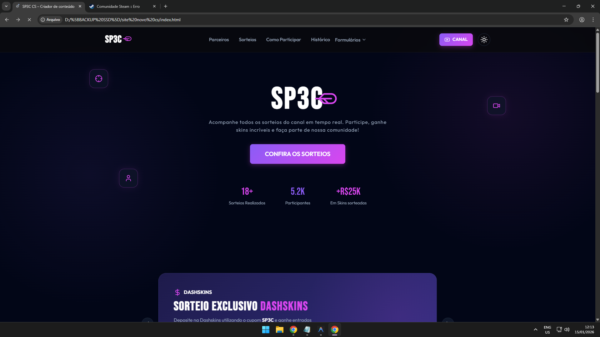
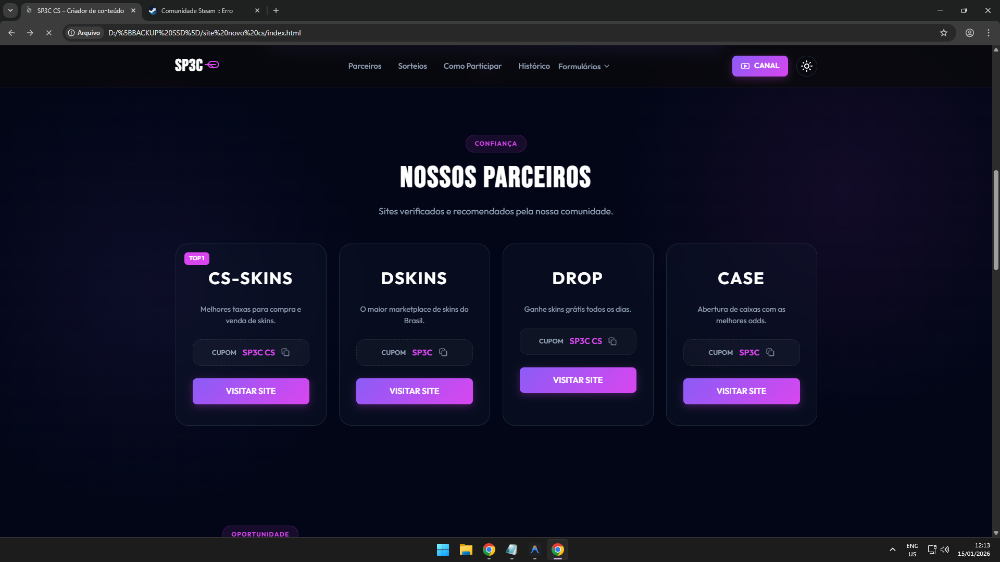
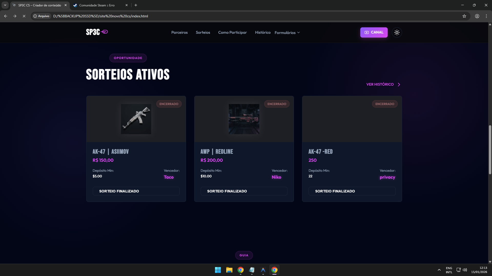
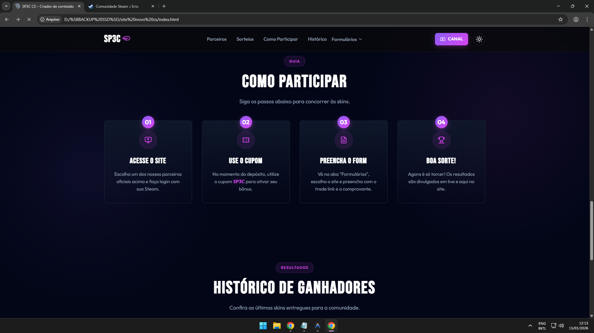
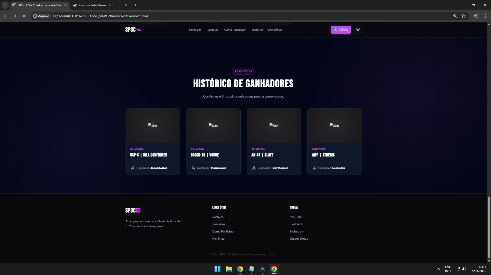

# SP3C CS - Plataforma de Sorteios de Skins CS2


Uma plataforma moderna e premium desenvolvida para criadores de conteúdo de Counter-Strike, focada em gerenciar e exibir sorteios de skins de forma automatizada e atraente.

## 📸 Screenshots

<div align="center">
  
  
  
  
  
</div>

## ✨ Funcionalidades

### 🏠 Landing Page (Principal)
- **Hero Dinâmico**: Apresentação de alto impacto com estatísticas do canal.
- **Grade de Parceiros**: Exibição de sites parceiros com sistema de "copiar cupom" interativo.
- **Sorteios Ativos**: Cards detalhados com informações da skin, valor e depósito mínimo.
- **Countdown em Tempo Real**: Contagem regressiva precisa para o encerramento dos sorteios.
- **Guia de Participação**: Passo a passo intuitivo para os usuários.
- **Histórico de Ganhadores**: Seção dedicada para exibir as últimas skins entregues.

### 🛡️ Painel Administrativo
- **Gestão de Sorteios**: Adicionar, editar e remover sorteios através de uma interface intuitiva.
- **Sistema de Data/Hora**: Configuração precisa de término via calendário.
- **Sorteador Automático**: Ferramenta para escolher um vencedor aleatoriamente entre os participantes cadastrados.
- **Simulação de Dados**: Utiliza `localStorage` para persistência de dados no navegador, eliminando a necessidade inicial de um banco de dados complexo.

### 🎨 Design e UX
- **Estética Premium**: Uso de gradientes, glassmorphism e micro-animações.
- **Modo Escuro (Dark Mode)**: Layout otimizado para a comunidade gamer.
- **Totalmente Responsivo**: Experiência perfeita em celulares, tablets e desktops.

## 🚀 Tecnologias Utilizadas

- **HTML5**: Estrutura semântica e SEO friendly.
- **CSS3 (Vanilla)**: Design customizado com variáveis e animações otimizadas (GPU accelerated).
- **JavaScript (ES6+)**: Lógica dinâmica, manipulação de DOM e sistema de cronômetro.
- **Lucide Icons**: Biblioteca de ícones moderna e leve.
- **Google Fonts**: Tipografias personalizadas (Bebas Neue & Outfit).

## 📁 Estrutura do Projeto

```bash
├── assets/          # Imagens e ícones
├── pages/           # Páginas secundárias e formulários
│   ├── admin.html   # Painel administrativo
│   ├── CSSKINS.html # Formulário de participação 1
│   ├── dashskins.html # Formulário de participação 2
│   └── pirate.html  # Formulário de participação 3
├── index.html       # Página principal
├── style.css        # Estilização global e componentes
├── main.js          # Lógica principal e interações
└── admin.js         # Lógica do painel administrativo
```

## ⚙️ Como Utilizar

1. **Clonar o repositório:**
   ```bash
   git clone https://github.com/seu-usuario/site-novo-cs.git
   ```
2. **Abrir localmente:**
   Basta abrir o arquivo `index.html` em qualquer navegador moderno.
3. **Acessar Admin:**
   - Navegue até o rodapé e clique em **Admin**.
   - Senha padrão: `admin123`.

## 🛠️ Otimizações de Performance

Este site foi otimizado para voar! 🚀
- **Event Delegation**: Gerenciamento de cliques centralizado para economizar memória.
- **Lazy Loading**: Imagens só carregam quando aparecem na tela.
- **High FPS**: Animações utilizando `will-change` para processamento via GPU.
- **Zero Dependências Pesadas**: Código puro para carregamento instantâneo.

---
Desenvolvido por **Felipe Sp3c**
